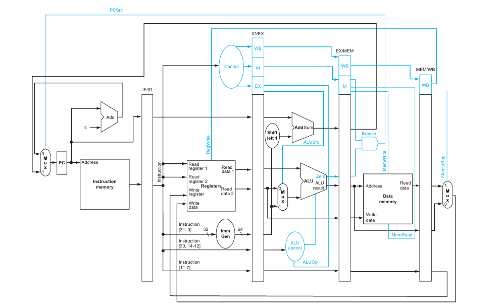
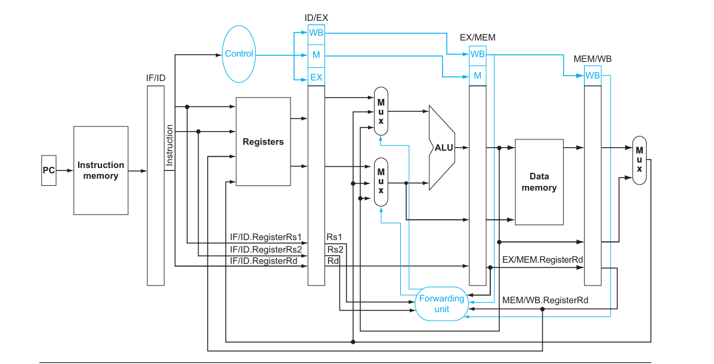

# 🧠 RISC-V Pipelined Processor (5-Stage)

This project implements a fully functional **5-stage pipelined RISC-V processor** in Verilog. The processor supports a subset of RISC-V RV32I instructions and includes a **forwarding unit** for data hazard resolution. This design does **not** include hazard detection or stalling logic.

---

## 📌 Features

- **RISC-V RV32I Base Instruction Set**  
- **5-Stage Pipeline Architecture**
  - **IF**: Instruction Fetch
  - **ID**: Instruction Decode
  - **EX**: Execute
  - **MEM**: Memory Access
  - **WB**: Write Back
- **Forwarding Unit** for resolving data hazards
- Modular design for easy testing and extensibility
- Asynchronous write + synchronous read pipeline registers
- Clean datapath with test-ready interfaces
- No hazard detection logic (branch delay slot assumed or flushed externally)

---

## 🏗️ Architecture Overview





### ⛓️ Pipeline Registers

- `IF_ID_Register`
- `ID_EX_Register`
- `EX_MEM_Register`
- `MEM_WB_Register`

Each stage stores both **data** and **control signals**, passed along to the next stage synchronously.

---

## 🔁 Forwarding Logic

This design supports **data forwarding** from:
- EX/MEM to EX stage
- MEM/WB to EX stage

The **`ForwardingUnit`** dynamically resolves hazards without introducing stalls:

```verilog
ForwardA = 2'b10; // Forward from EX/MEM
ForwardB = 2'b01; // Forward from MEM/WB
```

Combined with a 3-to-1 multiplexer (`Mux3to1`), operands are correctly selected even under dependency.

---

## 📦 Modules

| Module Name           | Description                            |
|-----------------------|----------------------------------------|
| `PC`                  | Program Counter                        |
| `Instruction_Memory`  | Read-only memory for instructions      |
| `Reg_File`            | 32x32 register file                    |
| `Immediate_Gen`       | Extracts immediate values              |
| `ALU_Control_unit`    | Generates ALU control signal           |
| `ALU`                 | Arithmetic and logic unit              |
| `Data_Memory`         | RAM with read/write control            |
| `Adder`, `Shifter`    | Branch logic                           |
| `Mux`, `Mux3to1`      | 2-to-1 and 3-to-1 multiplexers         |
| `ForwardingUnit`      | Forward control signals                |
| `IF_ID_Register`      | IF to ID stage register                |
| `ID_EX_Register`      | ID to EX stage register                |
| `EX_MEM_Register`     | EX to MEM stage register               |
| `MEM_WB_Register`     | MEM to WB stage register               |
| `DataPath`            | Top-level module connecting all units  |

---

## 🔧 How to Simulate

### 🛠️ Requirements
- Verilog simulation tool (e.g., **ModelSim**, **Icarus Verilog**, **Verilator**)
- Testbench module (you can provide your own or use the included one)

### 🧪 Running Simulation

1. Clone the repo:
   ```bash
   git clone https://github.com/yourusername/riscv-pipeline.git
   cd riscv-pipeline
   ```

2. Compile and run (example with Icarus Verilog):
   ```bash
   iverilog -o riscv.vvp *.v
   vvp riscv.vvp
   ```

3. (Optional) View waveform:
   ```bash
   gtkwave dump.vcd
   ```

---

## 📋 Instruction Support

Basic RV32I subset (most common ALU, branch, load/store instructions):

- `add`, `sub`, `and`, `or`, `xor`, `sll`, `srl`, `sra`
- `addi`, `andi`, `ori`
- `lw`, `sw`
- `beq`, `bne`

*Note: Branch hazards are not resolved through stalling; thus, control hazard behavior is limited unless flushed externally.*

---

## ⚠️ Known Limitations

- ❌ **No hazard detection** for control or load-use hazards  
- ❌ **No pipeline flushing on mispredicted branches**
- ❌ **No support for `jal`, `jalr`, or CSR instructions**
- ✔️ Assumes test programs are "safe" (scheduled to avoid hazards)

---

## 🛣️ Future Work

- Add pipeline flushing and hazard detection logic
- Implement branch prediction or stall logic
- Support full RV32I instruction set
- Integrate with assembler or memory loader

---

## 📁 File Structure

```
├── DataPath.v               # Top-level processor datapath
├── ForwardingUnit.v         # Forwarding logic
├── IF_ID_Register.v         # IF/ID pipeline register
├── ID_EX_Register.v         # ID/EX pipeline register
├── EX_MEM_Register.v        # EX/MEM pipeline register
├── MEM_WB_Register.v        # MEM/WB pipeline register
├── ALU.v, ALU_Control.v     # ALU + control unit
├── Instruction_Memory.v     # ROM
├── Data_Memory.v            # RAM
├── Reg_File.v               # Register file
├── Immediate_Gen.v          # Immediate generator
├── Mux.v, Mux3to1.v         # Multiplexers
├── Testbench.v              # Simulation testbench (optional)
```

---

## 📜 License

This project is open-source. You may reuse it in academic or personal projects with attribution. Please credit the author if reused in public or commercial work.

---

## 🙌 Acknowledgements

Built as part of a Computer Architecture course/project. Inspired by the classic 5-stage RISC-V architecture from textbooks and real-world CPUs.

